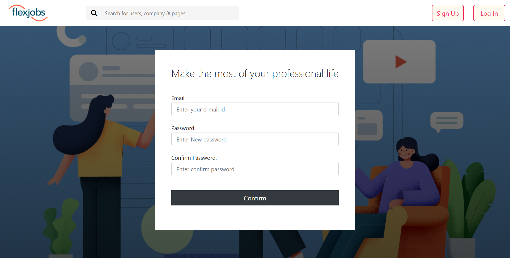
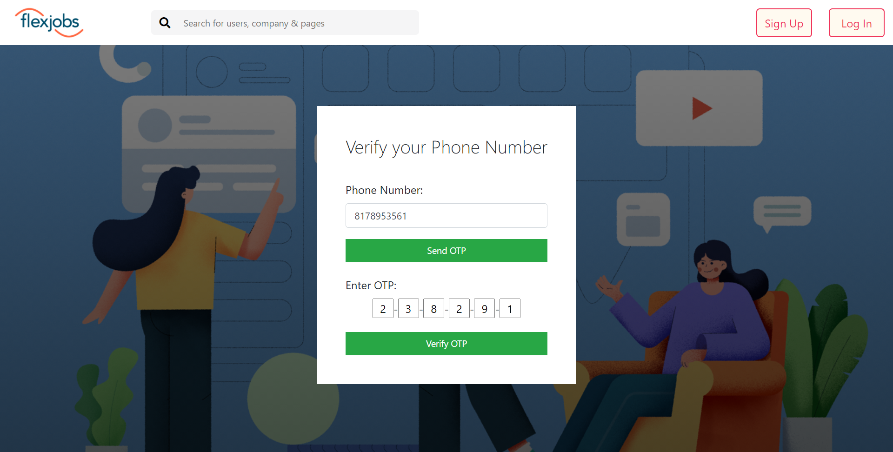
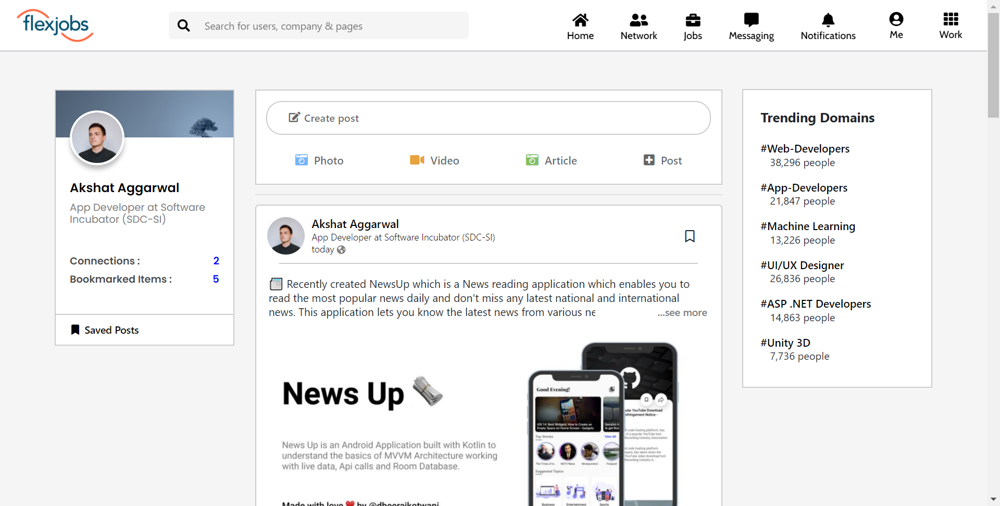
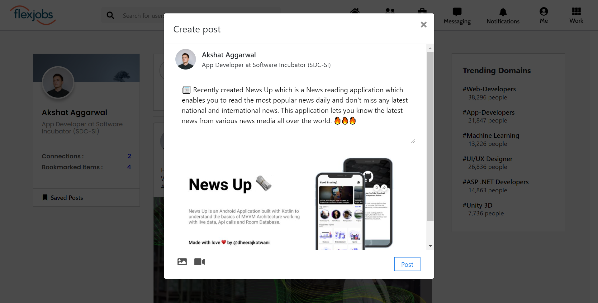
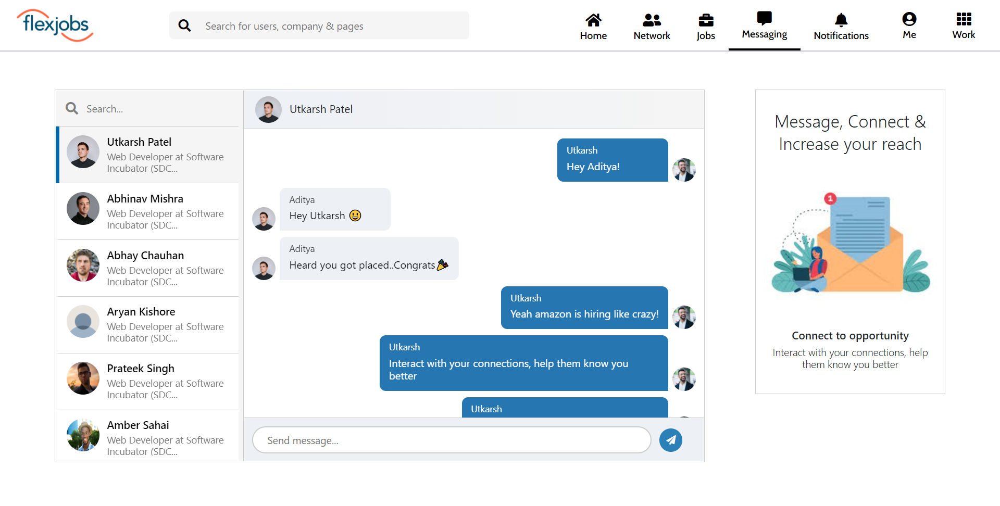
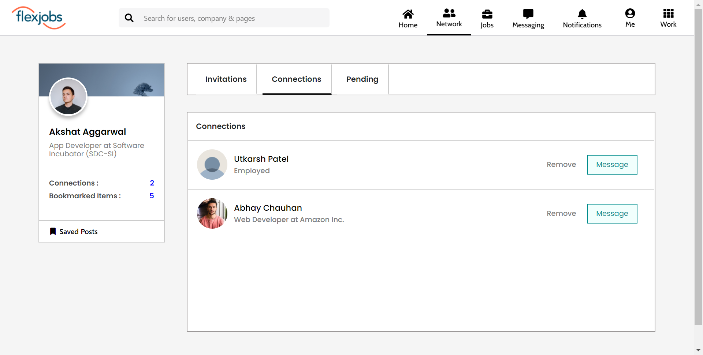
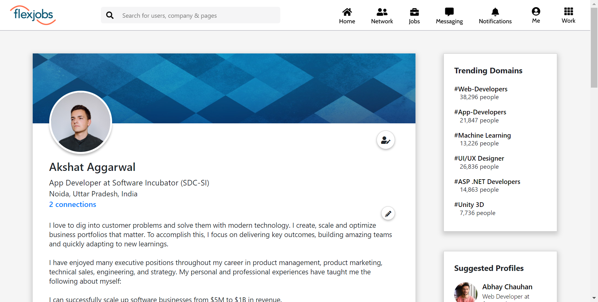
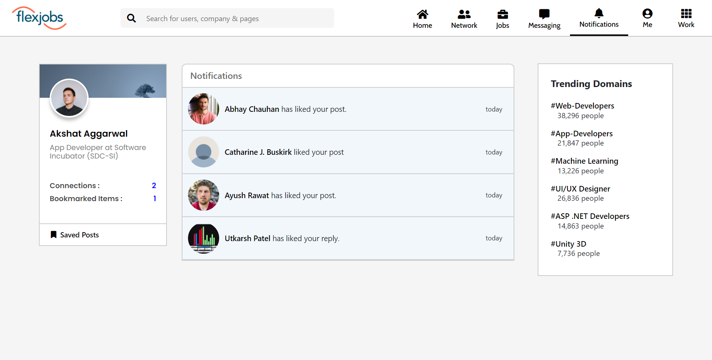
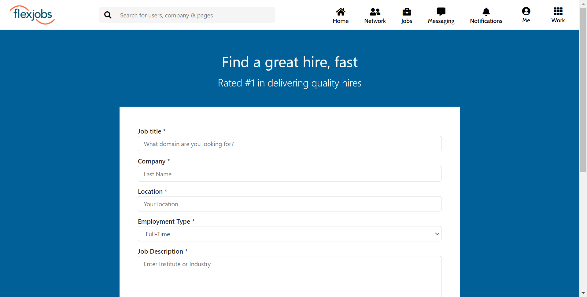
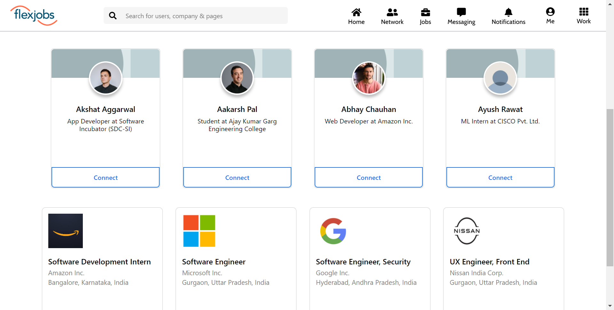

# LinkedIn-clone
A SPA using React JS &amp; DJango, where user can create account &amp; seek jobs as well as create jobs! 

## User SignUp

### 1. Email Signup

### 2. OTP verification

***

## Feed Page

***

## Create new post

***

## Message your connections

***

## Create a network

***

## User Profile

***

## Recieve notifications

***

## Hire employees by posting jobs

***

## Search for various users & available jobs

